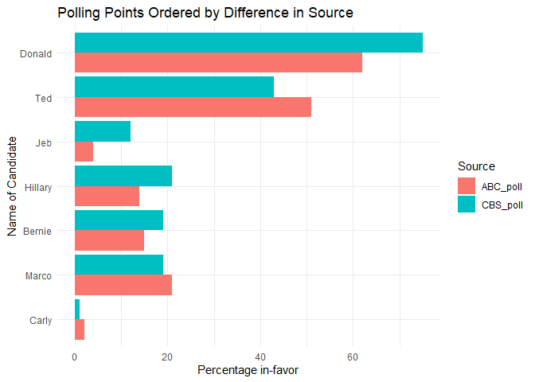

Assignment_02
================
Megan Xiao
2025-09-12

``` r
library(ggplot2)
library(reshape)
library(dplyr)
```

    ## 
    ## Attaching package: 'dplyr'

    ## The following object is masked from 'package:reshape':
    ## 
    ##     rename

    ## The following objects are masked from 'package:stats':
    ## 
    ##     filter, lag

    ## The following objects are masked from 'package:base':
    ## 
    ##     intersect, setdiff, setequal, union

## Define and Inspect Your Data

First, I create the following vectors “Name”, “ABC_poll”, and
“CBS_poll.” “Name” contains a list of recent presidential
candidates.”ABC_poll” and “CBS_poll” represent the percentage (points)
of respondents in favor of the corresponding candidate.

``` r
Name <- c("Jeb", "Donald", "Ted", "Marco", "Carly", "Hillary", "Bernie")
ABC_poll <- c(4, 62, 51, 21, 2, 14, 15)
CBS_poll <- c( 12, 75, 43, 19, 1, 21, 19)
```

I combine these vectors into a DataFrame.

``` r
df_polls <- data.frame(Name, ABC_poll, CBS_poll)
```

The resulting DataFrame has three columns and seven rows:

``` r
df_polls
```

    ##      Name ABC_poll CBS_poll
    ## 1     Jeb        4       12
    ## 2  Donald       62       75
    ## 3     Ted       51       43
    ## 4   Marco       21       19
    ## 5   Carly        2        1
    ## 6 Hillary       14       21
    ## 7  Bernie       15       19

Let’s look at the structure of the DataFrame.

``` r
str(df_polls)
```

    ## 'data.frame':    7 obs. of  3 variables:
    ##  $ Name    : chr  "Jeb" "Donald" "Ted" "Marco" ...
    ##  $ ABC_poll: num  4 62 51 21 2 14 15
    ##  $ CBS_poll: num  12 75 43 19 1 21 19

The “Name” column contains character values, while “ABC_poll” and
“CBS_poll” contains numeric values.

Head of df_polls:

``` r
head(df_polls)
```

    ##      Name ABC_poll CBS_poll
    ## 1     Jeb        4       12
    ## 2  Donald       62       75
    ## 3     Ted       51       43
    ## 4   Marco       21       19
    ## 5   Carly        2        1
    ## 6 Hillary       14       21

The head() function shows the first six rows of df_polls. Since df_polls
only has seven rows, this function is not really necessary. It’s better
used for large data sets.

## Compute Summary Statistics

The mean, median, and range of the ABC polls:

``` r
print(paste("Mean of ABC polls:",mean(df_polls$ABC_poll)))
```

    ## [1] "Mean of ABC polls: 24.1428571428571"

``` r
print(paste("Median of ABC polls:",median(df_polls$ABC_poll)))
```

    ## [1] "Median of ABC polls: 15"

``` r
print(paste("Range of ABC polls:",max(df_polls$ABC_poll) - min(df_polls$ABC_poll)))
```

    ## [1] "Range of ABC polls: 60"

The mean, median, and range of the CBS polls:

``` r
print(paste("Mean of CBS polls:",mean(df_polls$CBS_poll)))
```

    ## [1] "Mean of CBS polls: 27.1428571428571"

``` r
print(paste("Median of CBS polls:",median(df_polls$CBS_poll)))
```

    ## [1] "Median of CBS polls: 19"

``` r
print(paste("Range of CBS polls:",max(df_polls$CBS_poll) - min(df_polls$CBS_poll)))
```

    ## [1] "Range of CBS polls: 74"

Add a column for the difference of percentages between CBS and ABC
polls:

``` r
df_polls$Diff <- abs(df_polls$CBS_poll - df_polls$ABC_poll)
df_polls
```

    ##      Name ABC_poll CBS_poll Diff
    ## 1     Jeb        4       12    8
    ## 2  Donald       62       75   13
    ## 3     Ted       51       43    8
    ## 4   Marco       21       19    2
    ## 5   Carly        2        1    1
    ## 6 Hillary       14       21    7
    ## 7  Bernie       15       19    4

## Exploratory Data Analysis

Below, I create a bar plot that compares the percentages of respondents
in favor of each candidate. The bars are ordered by the biggest
difference in points between ABC polls and CBS polls.

``` r
df_polls.melt <- melt(df_polls, id.vars = c("Name","Diff"),measure.vars = c("ABC_poll","CBS_poll"))

df_polls.melt %>%
  arrange(Diff) %>%
  mutate(Name = factor(Name, levels = unique(Name))) %>%
  ggplot(aes(x = Name, y = value, fill = factor(variable))) + 
  geom_bar(stat="identity", position = position_dodge()) +
  theme_minimal() +
  coord_flip() +
  labs(fill = "Source",
       y = "Percentage in-favor",
       x = "Name of Candidate",
       title = "Polling Points Ordered by Difference in Source")
```

<!-- -->

## Discuss and Reflect

According to the data and the bar plot, Donald showed the largest
discrepancy between ABC and CBS. Candidates showing larger discrepancies
also had more respondents who were in favor of that candidate. The
correlation between the number of respondents showing favor and the
difference in the score may point to multicollinearity. Using made-up
data may introduce bias and inaccurate data, especially if one does not
have any background knowledge in the subject. Made-up data is also not
indicative of real life and, in this case, where the sample consists of
little rows and columns, makes it challenging for researchers to use the
data for training or testing. In real poll data, there would be other
columns describing each candidate, such as those who were not in favor
or those who were in favor who were Republican/Democrat. Extra columns
would give more insight into how certain variables may be correlated and
if they would have any effect on percentages in favor.
