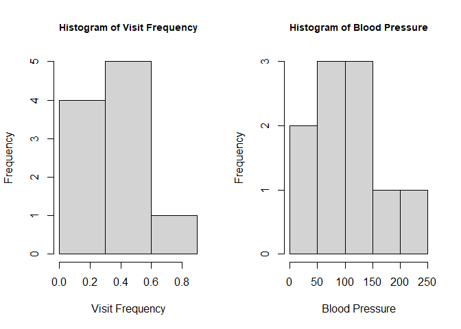

Assignment_04
================
Megan Xiao
2025-09-16

``` r
library(ggplot2)
library(reshape2)
```

## Data Preparation and Cleaning

First, define the 5 vectors: Frequency, BloodPressure, FirstAssess,
SecondAssess, and FinalDecision.<br>

Frequency represents either a vector of vital signs frequency or the
frequency of measurement.\* The vector is standardized since the numbers
go from 0 to 1.<br>

BloodPressure represents a vector of blood pressure measurements ranging
from 32 to 205. Lower values indicate hypotension (low blood pressure)
and higher values indicate hypertension (high blood pressure).<br>

FirstAssess, SecondAssess, and FinalDecision represent a vector of the
initial binary assessments of Frequency and BloodPressure. 1 equals a
bad reading/high indication of blood pressure, and 0 equals a good
reading/low indication of blood pressure.\*<br>

\*Since the task did not specify the representation of some columns, I
made an estimated guess of their meanings in the context of hospital
data.<br>

``` r
Frequency     <- c(0.6, 0.3, 0.4, 0.4, 0.2, 0.6, 0.3, 0.4, 0.9, 0.2)
BloodPressure <- c(103, 87, 32, 42, 59, 109, 78, 205, 135, 176)
FirstAssess   <- c(1, 1, 1, 1, 0, 0, 0, 0, NA, 1)    # good/low=0, bad/high=1
SecondAssess  <- c(0, 0, 1, 1, 0, 0, 1, 1, 1, 1)    # good/low=0, bad/high=1
FinalDecision <- c(0, 1, 0, 1, 0, 1, 0, 1, 1, 1)    # good/low=0, bad/high=1
```

There is 1 NA value in FirstAssess. We can replace it with the most
common value in the vector.<br>

``` r
FirstAssess[is.na(FirstAssess)] <- 1
FirstAssess
```

    ##  [1] 1 1 1 1 0 0 0 0 1 1

We then create a DataFrame using the five vectors.<br>

``` r
df_hosp <- data.frame(
  Frequency, BloodPressure, FirstAssess,
  SecondAssess, FinalDecision, stringsAsFactors = FALSE
)
```

And inspecting the summary statistics for the DataFrame:<br>

``` r
summary(df_hosp)
```

    ##    Frequency    BloodPressure     FirstAssess   SecondAssess FinalDecision
    ##  Min.   :0.20   Min.   : 32.00   Min.   :0.0   Min.   :0.0   Min.   :0.0  
    ##  1st Qu.:0.30   1st Qu.: 63.75   1st Qu.:0.0   1st Qu.:0.0   1st Qu.:0.0  
    ##  Median :0.40   Median : 95.00   Median :1.0   Median :1.0   Median :1.0  
    ##  Mean   :0.43   Mean   :102.60   Mean   :0.6   Mean   :0.6   Mean   :0.6  
    ##  3rd Qu.:0.55   3rd Qu.:128.50   3rd Qu.:1.0   3rd Qu.:1.0   3rd Qu.:1.0  
    ##  Max.   :0.90   Max.   :205.00   Max.   :1.0   Max.   :1.0   Max.   :1.0

<br>Frequency has a similar mean and median, meaning it most likely has
a normal distribution. BloodPressure has a higher mean compared to the
median, meaning it is skewed to the right. FirstAssess, SecondAssess,
and FinalDecision have lower means compared to the median, meaning it is
skewed to the left.<br>

The presence of skewness means outliers may overestimate or
underestimate the most common measurements. We can use a box plot to
determine the outliers.<br>

## Generate Basic Visualizations

``` r
par(mfrow = c(1,3))
boxplot(BloodPressure ~ FirstAssess,
        data = df_hosp,
        names = c("Low","High"),
        ylab = "Blood Pressure",
        main = "BP by First MD Assessment",
        cex.main = .95)
boxplot(BloodPressure ~ SecondAssess,
  data = df_hosp,
  names = c("Low","High"),
  ylab = "Blood Pressure",
  main = "BP by Second MD Assessment",
  cex.main = .95)
boxplot(
  BloodPressure ~ FinalDecision,
  data = df_hosp,
  names = c("Low","High"),
  ylab = "Blood Pressure",
  main = "BP by Final Decision",
  cex.main = .95)
```

<!-- --> <br>No
outliers exist in any of the box plots. In the first assessment,
individuals with low/good readings had higher blood pressure. The second
assessment consisted of more varied blood pressures for those with bad
readings. The final decision shows some correlation opposite to the
first assessment, where individuals with lower blood pressures had good
readings, while individuals with higher blood pressures had bad
readings.<br>

Let’s also investigate how the differences in frequency variation are
based on assessment reading.<br>

``` r
par(mfrow = c(1,3))
boxplot(Frequency ~ FirstAssess,
        data = df_hosp,
        names = c("Low","High"),
        ylab = "Frequency",
        main = "Frequency by First MD Assessment",
        cex.main = .7)
boxplot(Frequency ~ SecondAssess,
  data = df_hosp,
  names = c("Low","High"),
  ylab = "Frequency",
  main = "Frequency by Second MD Assessment",
  cex.main = .7)
boxplot(
  Frequency ~ FinalDecision,
  data = df_hosp,
  names = c("Low","High"),
  ylab = "Frequency",
  main = "Frequency by Final Decision",
  cex.main = .7)
```

<!-- -->
<br>The first and second assessments both contain one outlier. Low/bad
readings had more varied frequencies. The second assessment had a lower
median for high readings compared to the first assessment. However,
neither readings reflect the final decision accurately.<br>

We can also use a scatterplot to view the relationship between blood
pressure and frequency.<br>

``` r
ggplot(data=df_hosp, aes(x=BloodPressure, y=Frequency)) + geom_point()
```

<!-- -->
<br>There is a positive weak correlation between frequency and blood
pressure; as blood pressure increases, so does frequency.<br>

Lastly, let’s see how varied our numerical data for frequency and blood
pressure is with a histogram.<br>

``` r
par(mfrow = c(1,2))
hist(
  df_hosp$Frequency,
  breaks = seq(0, 1, by = 0.3),
  xlab = "Visit Frequency",
  main = "Histogram of Visit Frequency",
  cex.main = .9
)

hist(
  df_hosp$BloodPressure,
  breaks = 5,
  xlab = "Blood Pressure",
  main = "Histogram of Blood Pressure",
  cex.main = .9
)
```

<!-- -->
<br>Both frequency and blood pressure are skewed to the right. This
means larger values exist, but they aren’t common, thus skewing the mean
to the right. Common/average values tend to center around the median
rather than the mean.<br>

## First Assessment VS Second Assessment for Predicting Final Decision

Which does better at predicting the final decision: the first or the
second assessment? We can answer this question using a logistic
regression algorithm.<br>

Creating a confusion matrix based on a logistic regression model will
allow us to see which training set (the first assessment and the second
assessment) predicts more accurate results when compared to the test set
(the final decision).

I created a function that takes in the training and test sets as
arguments. Using a logistic regression model, the algorithm fits a
sigmoid line based on the predictors blood pressure AND frequency.\* We
can then use the sigmoid line to predict new binomial outputs and
compare them to the actual results (the test set).<br>

\*Using just blood pressure OR frequency to create a fitted line may
work better than using both predictors. However, due to time, I used
both in this analysis.<br>

``` r
log_reg <- function(train, test, plot_name){
  train_set <- train #first or second assessment
  test_set <- test #final decision
  
  log_model <- glm(train_set ~ BloodPressure + Frequency, data=df_hosp, family = "binomial") #logistic model (high or low) prediction based on blood pressure AND frequency
  predict_reg <- predict(log_model, type = "response")
  predict_reg <- as.data.frame(predict_reg)
  predict_reg <- round(unlist(predict_reg))
                       
  conf_matrix <- table(test, predict_reg)

  conf_matrix_melted <- as.data.frame(conf_matrix)
  colnames(conf_matrix_melted) <- c("Actual","Predicted","Count")

  conf_matrix_result <- ggplot(conf_matrix_melted, aes(x = Actual, y = Predicted, fill = Count)) +
    geom_tile() +
    geom_text(aes(label = Count), color = "black", size = 6) + 
    scale_fill_gradient(low = "white", high = "blue") +
    theme_minimal() +
    labs(title = sprintf("Confusion Matrix For %s",plot_name))
  return(conf_matrix_result)
}
```

<br>Confusion matrix of FirstAssess:<br>

``` r
first_train <- df_hosp$FirstAssess
test <- df_hosp$FinalDecision
log_reg(first_train, test, "First Assessment")
```

<!-- -->

<br>Confusion matrix of SecondAssess:<br>

``` r
second_train <- df_hosp$SecondAssess
log_reg(second_train, test, "Second Assessment")
```

<!-- -->
<br>When we fit a sigmoid line based on blood pressure AND frequency,
the second assessment produced slightly more accurate results than the
first assessment (6 accurate predictions vs 4 accurate predictions).
Therefore, the second assessment is a better indicator of the final
decision outputs.<br>

## Interpretation and Discussion

In the box plots, the values in the first and second assessment center
around 100 for both low and high assessments. In the third assessment,
however, the blood pressures for low and high outputs are vastly
different, with the values centered around 50 for individuals with low
readings, and values centered around 130 for those with high
readings.<br>

While there are no outliers in any of the assessments for blood
pressure, larger/smaller values from the median skew the variance; this
is noticeable in the first and second assessments in blood pressure,
where the first and third quartiles are far from the median. The
variance of the final decision is significantly less.<br>

Made-up data limits the accuracy of results by introducing potential
bias or misleading information. It may not reflect reality, especially
for a data set with a minimal number of rows. Made-up data can be
beneficial for testing certain functions or algorithm scenarios, but
should not be compared to real-life data on a humanistic/social-science
level.<br>

NA values are common in data sets. I decided to handle the NA value here
by replacing it with the most common number in its vector due to time
constraints. However, this practice is not recommended in real-life data
sets where there are hundreds or thousands of NA values. The best
practices are to analyze patterns in other columns that occur with NA
values, and then handle them based on those findings. <br>
