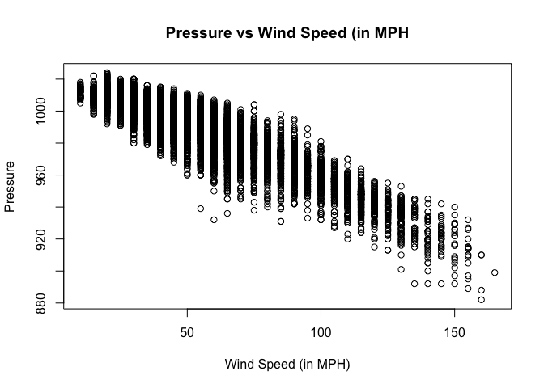
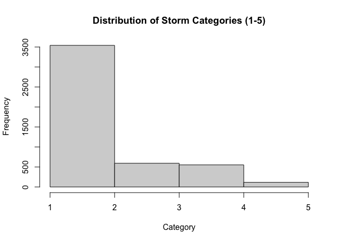
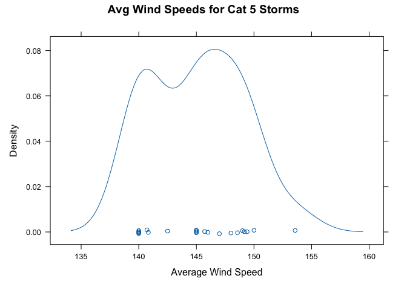
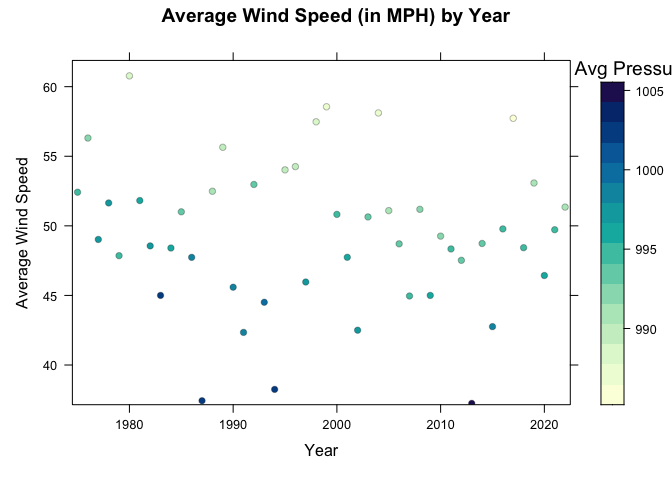
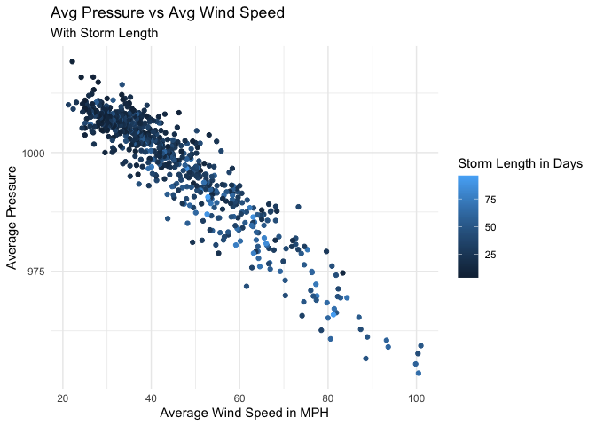
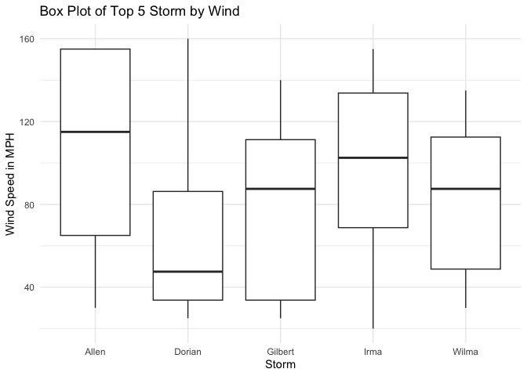

Assignment_09
================
Author: Megan Xiao

Date: 2025-10-27

## Choose a Dataset

R packages contain various data sets for users to practice and work
with. For this assignment, I chose the “storms” data set from the dplyr
package. This data set contains ~19000 rows on storms with columns on
wind speed, location, pressure, and more. <br> We load the data set in
with the data() function, specifying the name of the data set and the
package it originates from. Then, we can analyze the first 6 rows using
the head() function: <br>

``` r
data("storms", package = "dplyr")
head(storms)
```

    ##   name year month day hour  lat  long              status category wind
    ## 1  Amy 1975     6  27    0 27.5 -79.0 tropical depression       NA   25
    ## 2  Amy 1975     6  27    6 28.5 -79.0 tropical depression       NA   25
    ## 3  Amy 1975     6  27   12 29.5 -79.0 tropical depression       NA   25
    ## 4  Amy 1975     6  27   18 30.5 -79.0 tropical depression       NA   25
    ## 5  Amy 1975     6  28    0 31.5 -78.8 tropical depression       NA   25
    ## 6  Amy 1975     6  28    6 32.4 -78.7 tropical depression       NA   25
    ##   pressure tropicalstorm_force_diameter hurricane_force_diameter
    ## 1     1013                           NA                       NA
    ## 2     1013                           NA                       NA
    ## 3     1013                           NA                       NA
    ## 4     1013                           NA                       NA
    ## 5     1012                           NA                       NA
    ## 6     1012                           NA                       NA

## Base R Graphics

Base R provides users with basic visualization functions. Although
limited, they are useful for general exploratory analysis. <br> First, I
explore the relationships between wind speed and pressure of all the
storms. To do this, I use the plot() function, plotting pressure based
on wind speed: <br>

``` r
plot(storms$pressure~ storms$wind,
     ylab = "Pressure",
     xlab = "Wind Speed (in MPH)",
     main = "Pressure vs Wind Speed (in MPH")
```

<!-- --> <br>As
wind speed increases, pressure decreases. This makes sense because
changes in air density causes changes in pressure. <br> Now, let’s
observe the frequency of category 1-5 storms using a histogram: <br>

``` r
hist(storms$category,
     breaks = 5,
     xlab = "Category",
     main = "Distribution of Storm Categories (1-5)")
```

<!-- -->
<br>Most storms are category 1 storms and the graph skews to the right.
I was a bit surprised by this result, as I did not think category 2+
storms were rare compared to category 1 storms. <br>

## Lattice Graphics

The lattice package, written by Deepayan Sarkar, enhances Base R graphs
by improving visualizations of multivariate relationships. I will use
the dplyr package to manipulate the data and lattice to create the
visualizations. <br>

``` r
library(dplyr)
```

    ## 
    ## Attaching package: 'dplyr'

    ## The following objects are masked from 'package:stats':
    ## 
    ##     filter, lag

    ## The following objects are masked from 'package:base':
    ## 
    ##     intersect, setdiff, setequal, union

``` r
library(lattice)
library(latticeExtra)
```

After loading the two packages, I create a copy of the storms DataFrame
so I can manipulate it without changing the original. Then, I use dplyr
to create a new DataFrame from it. “s_avg_wind” contains the average
wind speeds for each category 5 storm. Finally, I create a density plot
with the densityplot() function, where the average wind speed is the x
variable: <br>

``` r
s_df <- storms
s_avg_wind <- s_df %>%
  group_by(name) %>%
  filter(category == 5) %>%
  summarise(avg_wind_speed = mean(wind))
  
densityplot(~avg_wind_speed,data=s_avg_wind,
            xlab = "Average Wind Speed",
            main = "Avg Wind Speeds for Cat 5 Storms")
```

<!-- -->
<br>Most points cluster around the 140-150 mph area. There appears to be
an outlier around 155. Most of these values are typical for a category 5
storm. <br> Next, I analyze average wind speed and pressure of all
storms by year. After grouping the storm data by year and creating
columns for average wind speed and pressure, I used the levelplot()
function to understand how average wind speed and pressure correlate as
time changes. <br>

``` r
s_pressure <- s_df %>%
  group_by(year) %>%
  summarise(avg_wind_speed = mean(wind), avg_pressure = mean(pressure))

levelplot(avg_pressure ~ year * avg_wind_speed,
          data = s_pressure,
          panel = panel.levelplot.points,
          xlab = "Year",
          ylab = "Average Wind Speed",
          main = "Average Wind Speed (in MPH) by Year",
          colorkey = list(title = "Avg Pressure",
                          title.control = list(side = "top"))
          )
```

<!-- -->
<br>There doesn’t seem to be a correlation between average wind speed or
year. As analyzed before, pressure decreases as wind speed increases.
<br> \## Using ggplot2 One of the most popular visualization packages is
ggplot2, a system for declaratively creating graphics.

``` r
library(ggplot2)
```

    ## 
    ## Attaching package: 'ggplot2'

    ## The following object is masked from 'package:latticeExtra':
    ## 
    ##     layer

First, I will explore the relationships between average wind speed,
average pressure, and length of storm in days. I use ggplot() and
geom_point() to graph this relationship: <br>

``` r
s_max <- s_df %>%
  group_by(name, year) %>%
  summarize(
    storm_length = n(),
    avg_wind = mean(wind),
    avg_pressure = mean(pressure)
  ) %>%
  arrange(desc(avg_wind))
```

    ## `summarise()` has grouped output by 'name'. You can override using the
    ## `.groups` argument.

``` r
ggplot(s_max, aes(x = avg_wind, y = avg_pressure, color=storm_length)) + 
  geom_point() +
  labs(title = "Avg Pressure vs Avg Wind Speed",
       subtitle = "With Storm Length",
       x = "Average Wind Speed in MPH",
       y = "Average Pressure",
       color = "Storm Length in Days") +
  theme_minimal()
```

<!-- --> <br>As
wind speed increases and pressure decreases, storm length appears to
increase. This may be due to the fact that when a storm has more time to
develop, there is a higher likelihood it becomes a stronger storm. <br>
Finally, I compare the wind speeds of the 5 strongest storms based on
max wind speeds. First, I obtain the storm names by grabbing the names
with the highest wind speeds. Then I use those five names to filter for
the rows containing those names, thus grabbing all wind speed data
points for the top 5 strongest storms. I use ggplot() and geom_boxplot()
to visualize how the 5 strongest storms differ in wind speeds: <br>

``` r
#box plot of top 5 strongest storm by max winds
s_top_5_names <- s_df %>%
  group_by(name) %>%
  summarise(max_wind = max(wind)) %>%
  arrange(desc(max_wind)) %>%
  slice_head(n=5)

s_top_5 <- s_df %>%
  filter(name == s_top_5_names$name)
```

    ## Warning: There was 1 warning in `filter()`.
    ## ℹ In argument: `name == s_top_5_names$name`.
    ## Caused by warning in `name == s_top_5_names$name`:
    ## ! longer object length is not a multiple of shorter object length

``` r
ggplot(s_top_5, aes(x = name, y = wind)) + geom_boxplot(outlier.color = "red") +
  labs(title = "Box Plot of Top 5 Storm by Wind",
       x = "Storm",
       y = "Wind Speed in MPH") +
  theme_minimal()
```

<!-- --> <br>It
appears Allen overall had the highest wind speeds while Dorian had the
lowest. <br>

## Discussion

<br>Base R uses an additive model where you start with a plot window and
layer elements using successive function calls. Lattice uses a single
function call based on trellis graphics, which shows the relationship
between multiple variables across different subsets of data. ggplot2
utilizes an additive approach to map data variables, aesthetic
properties (aes), geometric shapes (geom), and scales and facets
(facet_wrap or facet_grid). <br>

In my opinion, ggplot2 provides the most control and produces
“publication-quality” output. Although Base R offers more control,
achieving high-quality aesthetics, such as various font themes, axis
breaks, or complex legends, it requires a lot of manual tweaking.
ggplot2 possesses a layered structure and theme system, allowing for
more complex aesthetics without excessive effort. <br>

Changing between ggplot2, lattice, and Base R and getting used to the
syntax was the most challenging for me. Base R focuses on drawing one
element at a time, lattice focuses uses tildes to draw multivariate
graphs, and ggplot2 focuses on how variables are mapped onto graphs. I
spent more time fixing errors in lattice and Base R, whereas ggplot2
automatically handled legends, color scales, and faceting for me. <br>
